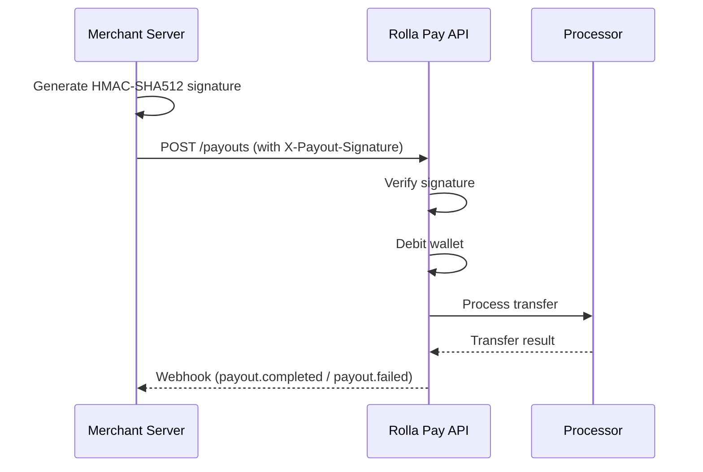

## Overview

The Payout API allows you to programmatically send money from your Rolla Pay wallet to any bank account or mobile money number. Use it for salary disbursements, vendor payments, commission payouts, and more.

## Payout Flow



## Payout Methods

<CardGroup cols={2}>
  <Card title="Bank Transfer" icon="building-columns" href="/api-reference/initiate-payout">
    Send funds to any bank account. Available for NGN.
  </Card>
  <Card title="Mobile Money" icon="mobile-screen" href="/api-reference/initiate-payout">
    Send funds to a mobile money wallet. Available for GHS, KES, ZMW.
  </Card>
</CardGroup>

## Security

Payout requests require **HMAC-SHA512 signature verification** in addition to your secret key. This ensures the request body has not been tampered with.

### Generating the Signature

Compute `HMAC-SHA512` of the JSON request body using your **secret key** as the signing key, and send it in the `X-Payout-Signature` header.

<CodeGroup>
```javascript Node.js
const crypto = require('crypto');

const secretKey = 'sk_live_your_secret_key';
const body = JSON.stringify({
  amount: 1000,
  currency: 'NGN',
  destination: {
    type: 'bank_account',
    bank_code: '000013',
    account_number: '0123456789',
    account_name: 'John Doe'
  },
  narration: 'Salary payment'
});

const signature = crypto
  .createHmac('sha512', secretKey)
  .update(body)
  .digest('hex');

// Send as: X-Payout-Signature: <signature>
```

```python Python
import hmac
import hashlib
import json

secret_key = 'sk_live_your_secret_key'
body = json.dumps({
    'amount': 1000,
    'currency': 'NGN',
    'destination': {
        'type': 'bank_account',
        'bank_code': '000013',
        'account_number': '0123456789',
        'account_name': 'John Doe'
    },
    'narration': 'Salary payment'
})

signature = hmac.new(
    secret_key.encode('utf-8'),
    body.encode('utf-8'),
    hashlib.sha512
).hexdigest()
```

```php PHP
$secretKey = 'sk_live_your_secret_key';
$body = json_encode([
    'amount' => 1000,
    'currency' => 'NGN',
    'destination' => [
        'type' => 'bank_account',
        'bank_code' => '000013',
        'account_number' => '0123456789',
        'account_name' => 'John Doe'
    ],
    'narration' => 'Salary payment'
]);

$signature = hash_hmac('sha512', $body, $secretKey);
```
</CodeGroup>

## Payout Statuses

| Status | Description |
|--------|-------------|
| `pending` | Payout has been created and wallet debited. Awaiting processor. |
| `processing` | Payout is being processed by the payment processor. |
| `completed` | Funds have been successfully transferred to the recipient. |
| `failed` | Payout failed. Funds have been refunded to the wallet. |

## Webhooks

When a payout completes or fails, Rolla Pay sends a webhook to your configured webhook URL.

### `payout.completed`

```json
{
  "event": "payout.completed",
  "data": {
    "reference": "WDR_A1B2C3D4E5F6",
    "merchant_reference": "SAL_JAN_001",
    "amount": 1000,
    "fee": 25,
    "net_amount": 975,
    "currency": "NGN",
    "status": "completed",
    "destination_account_number": "0123456789",
    "destination_bank_code": "000013",
    "destination_account_name": "John Doe",
    "completed_at": "2026-07-26T19:02:15.000Z"
  }
}
```

### `payout.failed`

```json
{
  "event": "payout.failed",
  "data": {
    "reference": "WDR_A1B2C3D4E5F6",
    "merchant_reference": "SAL_JAN_001",
    "amount": 1000,
    "fee": 25,
    "currency": "NGN",
    "status": "failed",
    "failure_reason": "Account not found",
    "failed_at": "2026-07-26T19:02:15.000Z"
  }
}
```

<Note>
Always verify the webhook signature using your webhook secret before updating any records. See the [Webhooks](/api-reference/webhooks) guide for details.
</Note>

## Error Codes

| HTTP | Message | Description |
|------|---------|-------------|
| 400 | Invalid payout signature | The `X-Payout-Signature` header does not match the request body. |
| 400 | Insufficient wallet balance | The wallet does not have enough funds for the payout + fee. |
| 400 | Wallet currency not found | No wallet exists for the specified currency. |
| 400 | Duplicate payout reference | A payout with this `reference` already exists. |
| 401 | Authentication required | Missing or invalid secret key. |
| 429 | Too many payout attempts | Rate limit exceeded (max 5 per hour per wallet). |
